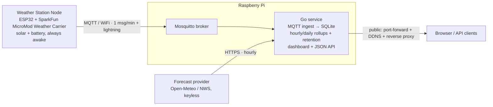
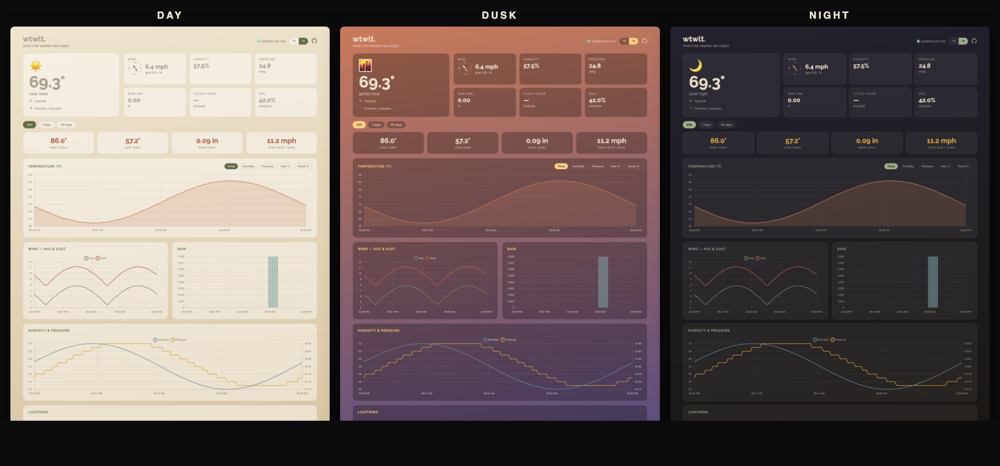

# wtwlt — What's The Weather Like Today

A self-hosted home weather station, built as a **monorepo**. An outdoor,
solar-powered ESP32 sensor node publishes readings over MQTT to a Raspberry Pi,
which logs them to SQLite and serves an earth-toned dashboard + JSON API.

- **`firmware/`** — ESP32 firmware for the sensor node (PlatformIO). Samples the
  sensor suite at 1 Hz, aggregates over a 60-second window, and publishes
  metric/SI readings to an MQTT broker. Lightning strikes are published as they
  happen. See [`firmware/README.md`](firmware/README.md).
- **`server/`** — the Raspberry Pi backend: a single **Go service** that ingests
  the station's MQTT messages into SQLite and serves the dashboard + JSON API from
  the same binary. It also pulls a near-term forecast from a keyless provider
  (Open-Meteo or NWS) to overlay on the charts. Ships with a local Mosquitto config
  and a Python mock publisher for exercising the pipeline without hardware. See
  [`server/README.md`](server/README.md).

## Architecture



**Data flow:** sensors → ESP32 samples @1 Hz → aggregates over 60 s → publishes
one JSON message per minute (plus event-driven lightning) to MQTT → the Go
service on the Pi subscribes, persists to SQLite (downsampling old data into
hourly/daily rollups), and serves the dashboard + API that read it. Separately,
the service polls a keyless forecast provider and stores the projection in its
own table for the dashboard's forecast overlay and tiles.

## Hardware

An **ESP32** (MicroMod form factor) on a **SparkFun MicroMod Weather Carrier**:

- **BME280** (I²C) — temperature, humidity, barometric pressure
- **VEML6075** (I²C) — UV index. *Optional:* current carriers ship with this
  footprint unpopulated (the part is EOL), so it's disabled by default
  (`ENABLE_UV 0`); `uv_index` then publishes as `null`.
- **AS3935** (SPI) — lightning detection (strike distance + energy)
- **SparkFun Weather Meter Kit** — anemometer, wind vane, tipping-bucket rain
  gauge (driven by the `SFEWeatherMeterKit` library)
- **Analog soil moisture** probe on the carrier's terminal
- **Power:** solar panel + LiPo, continuously awake (battery voltage reported in
  diagnostics)

**Pin map** (ESP32 MicroMod Processor on the Weather Carrier):

| Signal | Pin | Bus / notes |
|--------|-----|-------------|
| Wind direction (vane) | GPIO 35 (A1) | ADC1 — WiFi-safe analog |
| Wind speed (anemometer) | GPIO 14 (D0) | digital, interrupt |
| Rain gauge | GPIO 27 (D1) | digital, interrupt |
| Soil moisture | GPIO 34 (A0) | ADC1 analog; power-gated via GPIO 4 |
| AS3935 lightning | CS = GPIO 12, INT = GPIO 17 | SPI |
| BME280 | I²C | 0x77 |

Pins, cadence, and calibration constants live in
[`firmware/include/config.h`](firmware/include/config.h).

## Dashboard

An earth-toned dashboard whose palette shifts with the time of day and live
conditions (clear / dusk / night / rain / storm). Each chart continues past
"now" with a dashed, muted **forecast overlay** (temperature, humidity,
pressure, wind, precipitation) so the projection reads as one line with the
measured history, plus a row of **forecast condition tiles** (icon, high/low,
condition) — 4-hour segments on the 24h view, daily on the longer ranges:



## Forecast

Alongside its own measurements, the station shows a near-term forecast pulled
from a **keyless, no-signup provider** — **Open-Meteo** (default) or
**NWS/NOAA**. The Go service polls it on a timer and stores it in a separate
table (sensor data stays measurement-only); the dashboard then renders it as:

- a **dashed, muted overlay** that continues each chart past "now" so projected
  temperature, humidity, pressure, wind and precipitation read as one line with
  the measured history (the tail length adapts to how much history is shown);
- **condition tiles** — icon, high/low and a short description, in 4-hour
  segments on the 24h view and daily on the longer ranges;
- two forward-looking **lead-chart options**, *Rain chance* and *Cloud cover*
  (Open-Meteo only; NWS supplies precip probability but no cloud cover).

Set `WTWLT_LAT`/`WTWLT_LON` to enable it (leave them blank to turn it off);
`WTWLT_FORECAST_PROVIDER` selects the source. The coordinates are reverse-geocoded
(keyless OpenStreetMap Nominatim) to a coarse city/state label shown on the
dashboard — the **exact coordinates are never sent to the browser**. Units, the
unit toggle, and the `units=` API param apply to forecast values too. Details in
[`server/README.md`](server/README.md).

## MQTT data contract

The node publishes metric/SI values to the Mosquitto broker on the Pi (QoS 1;
retained LWT for status). `<station_id>` defaults to `wtwlt-01`.

| Topic | Purpose | Cadence |
|-------|---------|---------|
| `wtwlt/station/<station_id>/readings` | aggregated sensor readings | every 60 s |
| `wtwlt/station/<station_id>/lightning` | lightning strike events | on event |
| `wtwlt/station/<station_id>/status` | online/offline + identity (retained, LWT) | on connect/disconnect |

**`readings`** — absent sensors are emitted as `null`:

```json
{
  "station_id": "wtwlt-01",
  "ts": "2026-06-16T12:00:00Z",
  "interval_s": 60,
  "temp_c": 21.4,
  "humidity_pct": 58.2,
  "pressure_hpa": 1013.2,
  "uv_index": 3.1,
  "wind": { "avg_mps": 2.4, "gust_mps": 5.1, "dir_deg": 270, "dir_cardinal": "W" },
  "rain_mm": 0.5,
  "soil_moisture_pct": 42.0,
  "diagnostics": { "battery_v": 3.92, "rssi_dbm": -67, "uptime_s": 38211, "fw_version": "1.0.0" }
}
```

**`lightning`** — `event` ∈ `strike` | `disturber` | `noise` (only `strike` by default):

```json
{ "station_id": "wtwlt-01", "ts": "2026-06-16T12:00:03Z", "event": "strike", "distance_km": 12, "energy": 158473 }
```

**`status`** — retained; the LWT flips `online` to `false` on disconnect:

```json
{ "station_id": "wtwlt-01", "online": true, "fw_version": "1.0.0", "ip": "192.168.1.42", "boot_ts": "2026-06-16T01:23:45Z" }
```

Timestamps are UTC (the ESP32 syncs via SNTP; the server stamps arrival time if
the node's clock isn't set). Everything is stored metric; the API converts to
imperial on request via a `units=metric|imperial` query param.

## Build & flash the firmware

This repo uses [`just`](https://github.com/casey/just) as a task runner. Firmware
recipes are namespaced under `firmware`:

```bash
just firmware secrets   # create firmware/include/secrets.h from the template, then edit it
just firmware test      # host unit tests (no board needed)
just firmware build     # compile for the ESP32
just firmware flash     # flash over USB  (append /dev/cu.usbserial-XXXX for a specific port)
just firmware dev       # flash, then open the serial monitor
```

Run `just` with no arguments to list recipes and modules. Full instructions and
verification steps are in [`firmware/README.md`](firmware/README.md).

## Run the server pipeline (no hardware)

Exercise MQTT → Go ingest → SQLite → API end-to-end (requires `brew install mosquitto`):

```bash
just server broker   # terminal 1: start Mosquitto
just server run      # terminal 2: start the Go service (ingests -> SQLite, serves API)
just server setup    # terminal 3: one-time, create the mock venv
just server mock     # terminal 3: publish mock readings/lightning/status
```

Then open the dashboard at <http://localhost:8080/>, or `curl localhost:8080/api/current`.
Details in [`server/README.md`](server/README.md).

## Deploy to the Raspberry Pi

Cut a release from the GitHub **Actions → release** workflow (it cross-compiles
the server for `linux/arm64·amd64·arm` and publishes a GitHub Release). Then, on
the Pi:

```bash
curl -fsSL https://raw.githubusercontent.com/tlugger/wtwlt/main/install.sh | sudo bash
```

The installer picks the right binary for the Pi's architecture, provisions the
Mosquitto broker, installs a `systemd` service, and starts it. Re-running it
upgrades in place. Config lives in `/home/pi/wtwlt/.env`. Details in
[`server/README.md`](server/README.md).
